# 债券市场舆情分析平台 — PPT项目图表库

> 用于FICC 2026金融市场AI创新峰会汇报 | 基于Mermaid语法，可在支持Mermaid的PPT/文档工具中渲染

---

# 第一部分：痛点与愿景 — 从信息过载到智能决策

## 1.1 传统交易的效率瓶颈

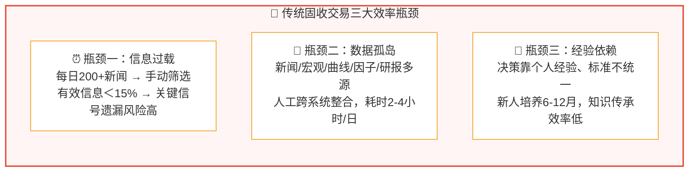
```mermaid
flowchart TD
    subgraph 痛点层["🔴 传统固收交易三大效率瓶颈"]
        direction TB

        P1["⏰ 瓶颈一：信息过载<br/>每日200+新闻 → 手动筛选<br/>有效信息＜15% → 关键信号遗漏风险高"]
        style P1 fill:#fff,stroke:#f39c12

        P2["🔗 瓶颈二：数据孤岛<br/>新闻/宏观/曲线/因子/研报多源<br/>人工跨系统整合，耗时2‑4小时/日"]
        style P2 fill:#fff,stroke:#f39c12

        P3["🤔 瓶颈三：经验依赖<br/>决策靠个人经验、标准不统一<br/>新人培养6‑12月，知识传承效率低"]
        style P3 fill:#fff,stroke:#f39c12
    end

    style 痛点层 fill:#fff5f5,stroke:#e74c3c,stroke-width:2px
```

## 1.2 多源数据整合难度

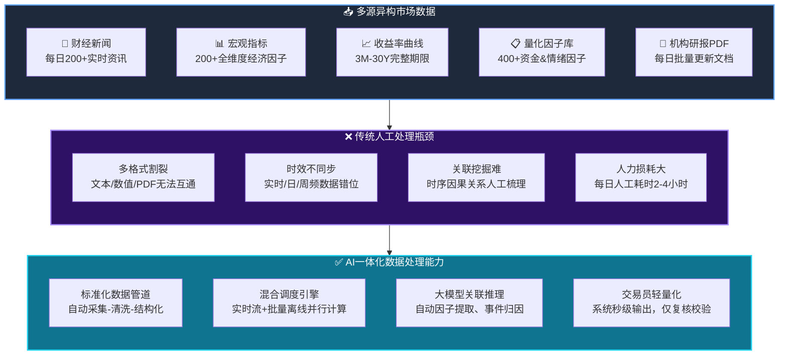
```mermaid
%% config: layout elk
flowchart TD
    subgraph 多源异构数据["📥 多源异构市场数据"]
        direction TB
        D1["📰 财经新闻<br/>每日200+实时资讯"]
        D2["📊 宏观指标<br/>200+全维度经济因子"]
        D3["📈 收益率曲线<br/>3M-30Y完整期限"]
        D4["📋 量化因子库<br/>400+资金&情绪因子"]
        D5["📑 机构研报PDF<br/>每日批量更新文档"]
    end

    subgraph 传统人工整合痛点["❌ 传统人工处理瓶颈"]
        direction TB
        E1["多格式割裂<br/>文本/数值/PDF无法互通"]
        E2["时效不同步<br/>实时/日/周频数据错位"]
        E3["关联挖掘难<br/>时序因果关系人工梳理"]
        E4["人力损耗大<br/>每日人工耗时2-4小时"]
    end

    subgraph AI智能整合方案["✅ AI一体化数据处理能力"]
        direction TB
        F1["标准化数据管道<br/>自动采集-清洗-结构化"]
        F2["混合调度引擎<br/>实时流+批量离线并行计算"]
        F3["大模型关联推理<br/>自动因子提取、事件归因"]
        F4["交易员轻量化<br/>系统秒级输出，仅复核校验"]
    end

    多源异构数据 --> 传统人工整合痛点
    传统人工整合痛点 --> AI智能整合方案

    %% 深色背景专用高对比配色
    classDef dataBox fill:#1E293B,stroke:#60A5FA,stroke-width:2px,rounded:10px,color:#fff
    classDef painBox fill:#2E1065,stroke:#A78BFA,stroke-width:2px,rounded:10px,color:#fff
    classDef targetBox fill:#0E7490,stroke:#22D3EE,stroke-width:2px,rounded:10px,color:#fff

    class 多源异构数据 dataBox
    class 传统人工整合痛点 painBox
    class AI智能整合方案 targetBox
```

## 1.3 平台核心愿景

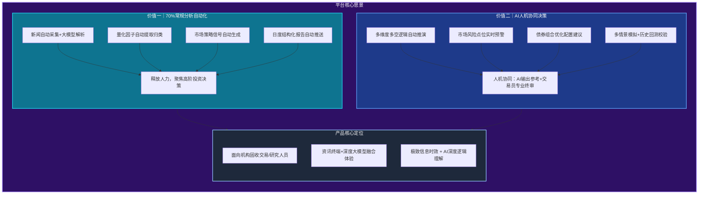
```mermaid
%% config: layout elk
flowchart TD
    subgraph s3["平台核心愿景"]
        direction TB
        
        subgraph s4["价值一｜70%常规分析自动化"]
            direction TB
            G1["新闻自动采集+大模型解析"]
            G2["量化因子自动提取归类"]
            G3["市场策略信号自动生成"]
            G4["日度结构化报告自动推送"]
            G1 & G2 & G3 & G4 --> G5["释放人力，聚焦高阶投资决策"]
        end

        subgraph s10["价值二｜AI人机协同决策"]
            direction TB
            H1["多维度多空逻辑自动推演"]
            H2["市场风险点位实时预警"]
            H3["多情景模拟+历史回测校验"]
            H4["债券组合优化配置建议"]
            H1 & H2 & H4 & H3 --> H5["人机协同：AI输出参考+交易员专业终审"]
        end

        subgraph s16["产品核心定位"]
            direction TB
            I1["面向机构固收交易/研究人员"]
            I2["资讯终端+深度大模型融合体验"]
            I3["极致信息时效 + AI深度逻辑理解"]
        end
    end

    s4 --> s16
    s10 --> s16

    %% 深色背景高对比配色
    classDef outerVision fill:#2E1065,stroke:#A78BFA,stroke-width:2px,rounded:10px,color:#fff
    classDef autoBox fill:#0E7490,stroke:#22D3EE,stroke-width:2px,rounded:10px,color:#fff
    classDef aiAssistBox fill:#1E3A8A,stroke:#60A5FA,stroke-width:2px,rounded:10px,color:#fff
    classDef posBox fill:#1E293B,stroke:#93C5FD,stroke-width:2px,rounded:10px,color:#fff

    class s3 outerVision
    class s4 autoBox
    class s10 aiAssistBox
    class s16 posBox
```

## 1.4 产品全景图

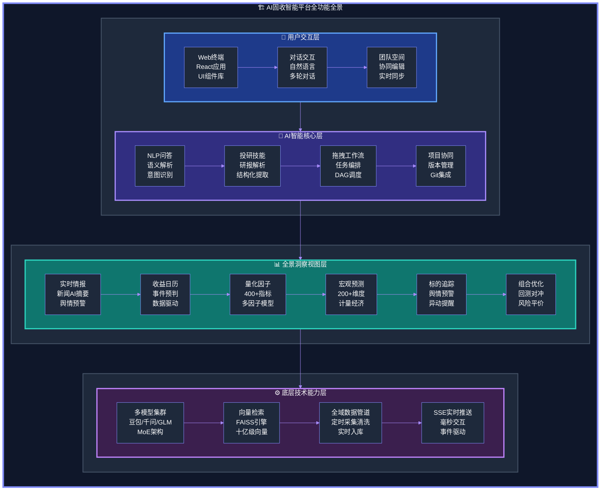
```mermaid
%%{init: {'theme': 'base', 'themeVariables': { 'primaryColor': '#1e293b', 'primaryTextColor': '#fff', 'primaryBorderColor': '#818cf8', 'lineColor': '#a78bfa', 'tertiaryColor': '#0f172a'}}}%%
flowchart TB
    subgraph platform["🏗️ AI固收智能平台全功能全景"]
        direction TB
        
        %% 第一行：用户交互层 + AI智能核心层（左右并排）
        subgraph row1[" "]
            direction LR
            subgraph user["👤 用户交互层"]
                direction LR
                U1["Web终端<br>React应用<br>UI组件库"] --> U2["对话交互<br>自然语言<br>多轮对话"] --> U3["团队空间<br>协同编辑<br>实时同步"]
            end
            subgraph ai["🤖 AI智能核心层"]
                direction LR
                A1["NLP问答<br>语义解析<br>意图识别"] --> A2["投研技能<br>研报解析<br>结构化提取"] --> A3["拖拽工作流<br>任务编排<br>DAG调度"] --> A4["项目协同<br>版本管理<br>Git集成"]
            end
            user --> ai
        end

        %% 第二行：全景洞察视图层（独占整行，居中）
        subgraph row2[" "]
            direction LR
            subgraph data["📊 全景洞察视图层"]
                direction LR
                D1["实时情报<br>新闻AI摘要<br>舆情预警"] --> D2["收益日历<br>事件预判<br>数据驱动"] --> D3["量化因子<br>400+指标<br>多因子模型"] --> D4["宏观预测<br>200+维度<br>计量经济"] --> D5["标的追踪<br>舆情预警<br>异动提醒"] --> D6["组合优化<br>回测对冲<br>风险平价"]
            end
        end

        %% 第三行：底层技术能力层（独占整行，居中）
        subgraph row3[" "]
            direction LR
            subgraph core["⚙️ 底层技术能力层"]
                direction LR
                C1["多模型集群<br>豆包/千问/GLM<br>MoE架构"] --> C2["向量检索<br>FAISS引擎<br>十亿级向量"] --> C3["全域数据管道<br>定时采集清洗<br>实时入库"] --> C4["SSE实时推送<br>毫秒交互<br>事件驱动"]
            end
        end

        %% 跨层主箭头串联（核心逻辑流）
        ai --> data
        data --> core
    end

    %% 美化样式定义（深色科技风 + 加粗边框，提升PPT质感）
    classDef outerBox fill:#0f172a,stroke:#818cf8,stroke-width:4px,color:#f8fafc
    classDef rowBox fill:#1e293b,stroke:#475569,stroke-width:2px,color:#f8fafc
    classDef userBox fill:#1e3a8a,stroke:#60a5fa,stroke-width:3px,color:#fff
    classDef aiBox fill:#312e81,stroke:#a78bfa,stroke-width:3px,color:#fff
    classDef dataBox fill:#0f766e,stroke:#2dd4bf,stroke-width:3px,color:#fff
    classDef coreBox fill:#3b1f4e,stroke:#c084fc,stroke-width:3px,color:#fff

    class platform outerBox
    class row1,row2,row3 rowBox
    class user userBox
    class ai aiBox
    class data dataBox
    class core coreBox
```

---

# 第二部分：核心引擎 — AI交互与深度理解

## 2.1 平台整体技术架构

```mermaid
%%{init: {'theme': 'base', 'themeVariables': {
  'background': '#111827',
  'primaryColor': '#1f2937',
  'primaryTextColor': '#f8fafc',
  'primaryBorderColor': '#60a5fa',
  'lineColor': '#94a3b8',
  'tertiaryColor': '#1e293b',
  'fontSize': '14px',
  'fontFamily': 'Segoe UI, sans-serif'
}}}%%
flowchart TB
    %% 前端层
    subgraph 前端["🖥️ 前端层 React+TS+Vite"]
        direction LR
        FE1["WorkbenchShell<br/>新工作台壳"]
        FE2["MarketSection<br/>市场板块"]
        FE3["ChatPage<br/>AI对话"]
        FE4["ComputerPage<br/>技能中心"]
        FE5["Feature Pages<br/>因子/宏观/策略"]
        FE1 --> FE2 --> FE3 --> FE4 --> FE5
    end
    
    %% API网关层
    subgraph 网关["🔐 API网关层 FastAPI"]
        direction LR
        GW1["CORS中间件"]
        GW2["JWT认证<br/>AUTH_ENABLED"]
        GW3["异常日志中间件"]
        GW4["SSE流式推送"]
        GW1 --> GW2 --> GW3 --> GW4
    end
    
    %% 路由层
    subgraph 路由["🔀 路由层 22+业务路由"]
        direction LR
        R1["/sapi/discover 发现页"]
        R2["/sapi/news 新闻"]
        R3["/sapi/chat 对话"]
        R4["/sapi/macro 宏观信号"]
        R5["/sapi/strategy 策略"]
        R6["/sapi/workbench 工作台"]
        R7["/sapi/dashboard 看板"]
        R8["/sapi/research 研报"]
        R1 --> R2 --> R3 --> R4 --> R5 --> R6 --> R7 --> R8
    end
    
    %% 业务服务层
    subgraph 服务["⚙️ 核心服务层"]
        direction LR
        S1["analysis 新闻分析管道"]
        S2["agent AI对话引擎"]
        S3["factor 因子管理"]
        S4["macrosignal 宏观计算"]
        S5["strategy 策略推荐"]
        S6["research_report 研报处理"]
        S7["push 多渠道推送"]
        S1 --> S2 --> S3 --> S4 --> S5 --> S6 --> S7
    end
    
    %% 数据层（方形节点）
    subgraph 数据["💾 数据存储层"]
        direction LR
        DB1["MySQL数据库<br/>Sentiment_analysis ~25表"]
        DB2["FAISS向量引擎<br/>语义检索索引"]
        DB1 --> DB2
    end
    
    %% 业务调用链路
    前端 -->|"HTTP / SSE"| 网关
    网关 --> 路由
    路由 --> 服务
    服务 --> 数据

    %% 外层子图深色科技配色（匹配AI-FICC蓝紫LOGO）
    classDef frontBox fill:#1e3a8a,stroke:#60a5fa,stroke-width:3px,rounded:8px
    classDef gateBox fill:#422006,stroke:#fbbf24,stroke-width:3px,rounded:8px
    classDef routeBox fill:#312e81,stroke:#a78bfa,stroke-width:3px,rounded:8px
    classDef svcBox fill:#0f766e,stroke:#2dd4bf,stroke-width:3px,rounded:8px
    classDef dataBox fill:#3b1f4e,stroke:#c084fc,stroke-width:3px,rounded:8px

    %% 内部文字节点：白底黑字，适配深色背景
    classDef nodeCard fill:#ffffff,stroke:#94a3b8,stroke-width:1.5px,color:#0f172a,rounded:6px

    %% 样式绑定
    class 前端 frontBox
    class 网关 gateBox
    class 路由 routeBox
    class 服务 svcBox
    class 数据 dataBox
    class FE1,FE2,FE3,FE4,FE5,GW1,GW2,GW3,GW4,R1,R2,R3,R4,R5,R6,R7,R8,S1,S2,S3,S4,S5,S6,S7,DB1,DB2 nodeCard
```

## 2.2 自然语言即时问答流程

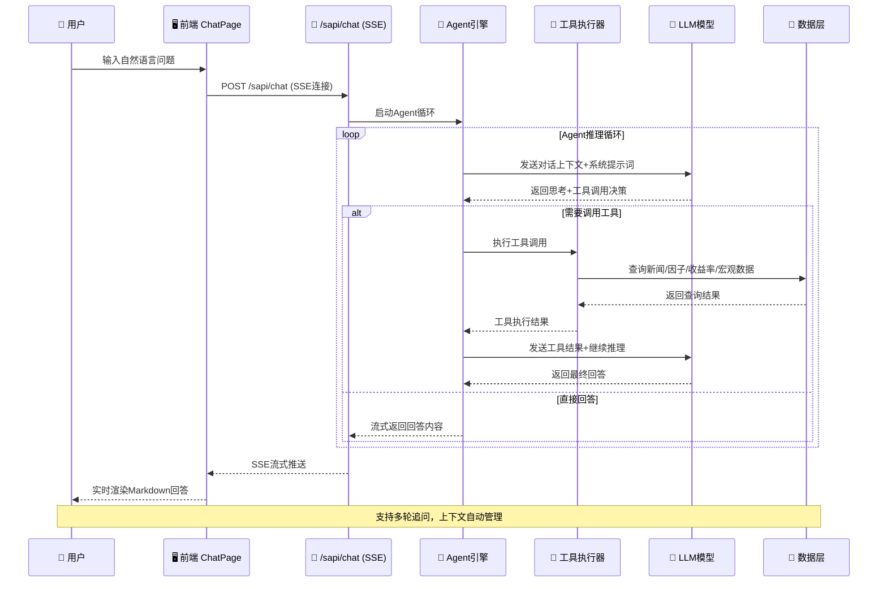
```mermaid
sequenceDiagram
    participant User as 👤 用户
    participant FE as 🖥️ 前端 ChatPage
    participant API as 🔀 /sapi/chat (SSE)
    participant Agent as 🤖 Agent引擎
    participant Tools as 🔧 工具执行器
    participant LLM as 🧠 LLM模型
    participant DB as 💾 数据层
    
    User->>FE: 输入自然语言问题
    FE->>API: POST /sapi/chat (SSE连接)
    API->>Agent: 启动Agent循环
    
    loop Agent推理循环
        Agent->>LLM: 发送对话上下文+系统提示词
        LLM-->>Agent: 返回思考+工具调用决策
        
        alt 需要调用工具
            Agent->>Tools: 执行工具调用
            Tools->>DB: 查询新闻/因子/收益率/宏观数据
            DB-->>Tools: 返回查询结果
            Tools-->>Agent: 工具执行结果
            Agent->>LLM: 发送工具结果+继续推理
            LLM-->>Agent: 返回最终回答
        else 直接回答
            Agent-->>API: 流式返回回答内容
        end
    end
    
    API-->>FE: SSE流式推送
    FE-->>User: 实时渲染Markdown回答
    
    Note over User,DB: 支持多轮追问，上下文自动管理
```

## 2.3 Agent工具编排架构

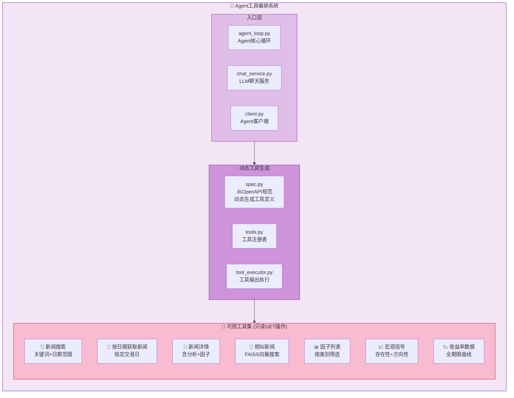
```mermaid
flowchart TB
    subgraph Agent系统["🤖 Agent工具编排系统"]
        direction TB
        
        subgraph 入口["入口层"]
            E1["agent_loop.py\nAgent核心循环"]
            E2["chat_service.py\nLLM聊天服务"]
            E3["client.py\nAgent客户端"]
        end
        
        subgraph 工具生成["动态工具生成"]
            T1["spec.py\n从OpenAPI规范\n动态生成工具定义"]
            T2["tools.py\n工具注册表"]
            T3["tool_executor.py\n工具输出执行"]
        end
        
        subgraph 工具集["🔧 可用工具集 (只读GET操作)"]
            direction TB
            TL1["📰 新闻搜索\n关键词+日期范围"]
            TL2["📅 按日期获取新闻\n指定交易日"]
            TL3["📄 新闻详情\n含分析+因子"]
            TL4["🔗 相似新闻\nFAISS向量搜索"]
            TL5["📊 因子列表\n按类别筛选"]
            TL6["📈 宏观信号\n存在性+方向性"]
            TL7["📉 收益率数据\n全期限曲线"]
        end
    end
    
    入口 --> 工具生成 --> 工具集
    
    style Agent系统 fill:#f3e5f5,stroke:#6a1b9a
    style 入口 fill:#e1bee7,stroke:#8e24aa
    style 工具生成 fill:#ce93d8,stroke:#7b1fa2
    style 工具集 fill:#f8bbd0,stroke:#ad1457
```

## 2.4 Computer智能技能中心架构

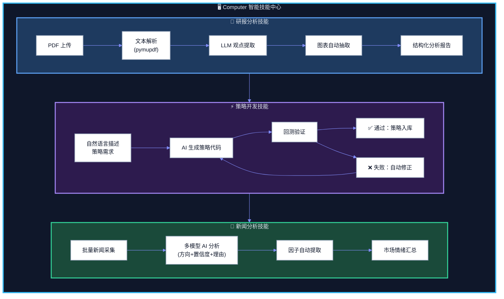
```mermaid
%%{init: {'theme': 'base', 'themeVariables': {
  'background': '#0f172a',
  'primaryColor': '#1e293b',
  'primaryTextColor': '#e2e8f0',
  'primaryBorderColor': '#38bdf8',
  'lineColor': '#818cf8',
  'secondaryColor': '#312e81',
  'tertiaryColor': '#0f172a',
  'fontFamily': 'Segoe UI, sans-serif',
  'fontSize': '14px'
}}}%%
flowchart TB
    subgraph Computer["🖥️ Computer 智能技能中心"]
        direction TB
        
        subgraph 研报分析["📑 研报分析技能"]
            direction LR
            RA1["PDF 上传"] --> RA2["文本解析<br/>(pymupdf)"] --> RA3["LLM 观点提取"] --> RA4["图表自动抽取"] --> RA5["结构化分析报告"]
        end
        
        subgraph 策略开发["⚡ 策略开发技能"]
            direction LR
            SD1["自然语言描述<br/>策略需求"] --> SD2["AI 生成策略代码"] --> SD3["回测验证"] 
            SD3 --> SD4["✅ 通过：策略入库"]
            SD3 --> SD5["❌ 失败：自动修正"]
            SD5 --> SD2
        end
        
        subgraph 新闻分析["📰 新闻分析技能"]
            direction LR
            NA1["批量新闻采集"] --> NA2["多模型 AI 分析<br/>(方向+置信度+理由)"] --> NA3["因子自动提取"] --> NA4["市场情绪汇总"]
        end
        
        研报分析 --> 策略开发 --> 新闻分析
    end

    %% 外层容器样式（深色科技风）
    style Computer fill:#0f172a,stroke:#38bdf8,stroke-width:3px,color:#e2e8f0
    
    %% 子模块背景（半透明科技色 + 高亮边框）
    style 研报分析 fill:#1e3a5f,stroke:#60a5fa,stroke-width:2.5px,color:#e2e8f0
    style 策略开发 fill:#2d1b4e,stroke:#a78bfa,stroke-width:2.5px,color:#e2e8f0
    style 新闻分析 fill:#1a4a3a,stroke:#34d399,stroke-width:2.5px,color:#e2e8f0

    %% 所有内部节点强制白底黑字
    classDef node fill:#ffffff,stroke:#94a3b8,stroke-width:1.5px,color:#0f172a,font-weight:500
    class RA1,RA2,RA3,RA4,RA5,SD1,SD2,SD3,SD4,SD5,NA1,NA2,NA3,NA4 node
```

---

# 第三部分：信息展示与数据分析

## 3.1 实时市场情报中心架构

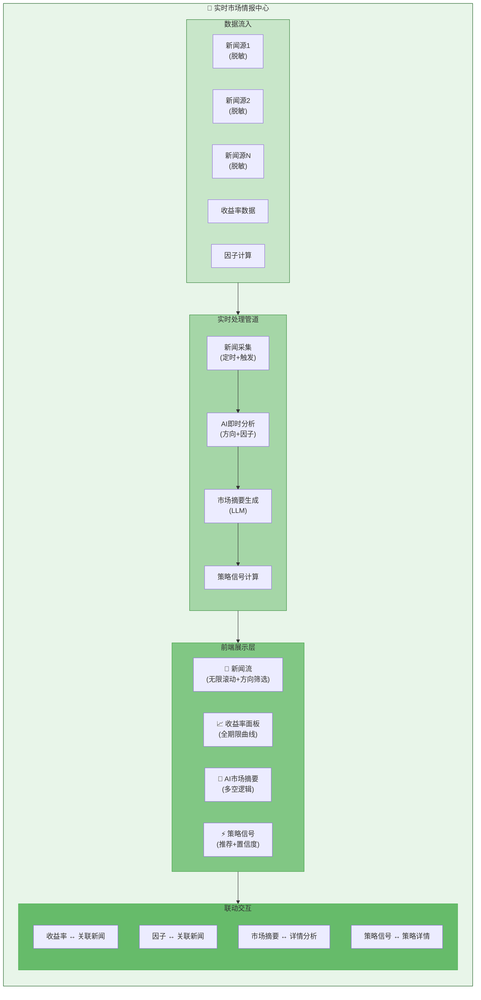
```mermaid
flowchart TB
    subgraph 市场情报["📡 实时市场情报中心"]
        direction TB
        
        subgraph 数据流["数据流入"]
            direction LR
            DS1["新闻源1\n(脱敏)"]
            DS2["新闻源2\n(脱敏)"]
            DS3["新闻源N\n(脱敏)"]
            DS4["收益率数据"]
            DS5["因子计算"]
        end
        
        subgraph 处理["实时处理管道"]
            direction TB
            P1["新闻采集\n(定时+触发)"] --> P2["AI即时分析\n(方向+因子)"]
            P2 --> P3["市场摘要生成\n(LLM)"]
            P3 --> P4["策略信号计算"]
        end
        
        subgraph 展示["前端展示层"]
            direction LR
            V1["📰 新闻流\n(无限滚动+方向筛选)"]
            V2["📈 收益率面板\n(全期限曲线)"]
            V3["🧠 AI市场摘要\n(多空逻辑)"]
            V4["⚡ 策略信号\n(推荐+置信度)"]
        end
        
        subgraph 联动["联动交互"]
            direction TB
            L1["收益率 ↔ 关联新闻"]
            L2["因子 ↔ 关联新闻"]
            L3["市场摘要 ↔ 详情分析"]
            L4["策略信号 ↔ 策略详情"]
        end
    end
    
    数据流 --> 处理 --> 展示 --> 联动
    
    style 市场情报 fill:#e8f5e9,stroke:#1b5e20
    style 数据流 fill:#c8e6c9,stroke:#2e7d32
    style 处理 fill:#a5d6a7,stroke:#388e3c
    style 展示 fill:#81c784,stroke:#43a047
    style 联动 fill:#66bb6a,stroke:#4caf50
```

## 3.2 发现页数据联动架构

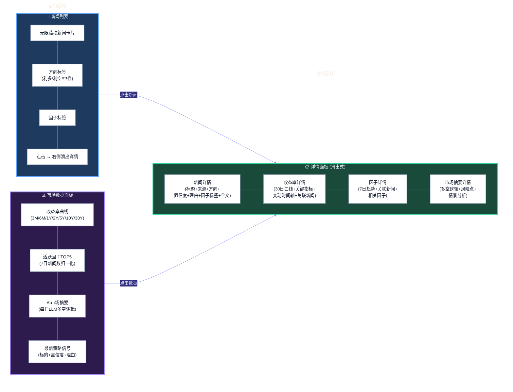
```mermaid
---
config:
  theme: base
  themeVariables:
    background: '#0f172a'
    primaryColor: '#1e293b'
    primaryTextColor: '#e2e8f0'
    primaryBorderColor: '#38bdf8'
    lineColor: '#818cf8'
    secondaryColor: '#312e81'
    tertiaryColor: '#0f172a'
    fontFamily: ''
    fontSize: 14px
---
flowchart LR
 subgraph 左侧["📰 新闻列表"]
    direction TB
        N1["无限滚动新闻卡片"]
        N2["方向标签<br>(利多/利空/中性)"]
        N3["因子标签"]
        N4["点击 → 右侧滑出详情"]
  end
 subgraph 中间["📊 市场数据面板"]
    direction TB
        M1["收益率曲线<br>(3M/6M/1Y/2Y/5Y/10Y/30Y)"]
        M2["活跃因子TOP5<br>(7日新闻数归一化)"]
        M3["AI市场摘要<br>(每日LLM多空逻辑)"]
        M4["最新策略信号<br>(标的+置信度+理由)"]
  end
 subgraph 首行区域["首行区域"]
    direction LR
        左侧
        中间
  end
 subgraph 右侧["📋 详情面板 (滑出式)"]
    direction LR
        D1["新闻详情<br>(标题+来源+方向+<br>置信度+理由+因子标签+全文)"]
        D2["收益率详情<br>(30日曲线+关键指标+<br>变动时间轴+关联新闻)"]
        D3["因子详情<br>(7日趋势+关联新闻+<br>相关因子)"]
        D4["市场摘要详情<br>(多空逻辑+风险点+<br>情景分析)"]
  end
 subgraph 次行区域["次行区域"]
    direction LR
        右侧
  end
    N1 --- N2
    N2 --- N3
    N3 --- N4
    M1 --- M2
    M2 --- M3
    M3 --- M4
    D1 --- D2
    D2 --- D3
    D3 --- D4
    左侧 -- 点击新闻 --> 右侧
    中间 -- 点击数据 --> 右侧

     N1:::node
     N2:::node
     N3:::node
     N4:::node
     M1:::node
     M2:::node
     M3:::node
     M4:::node
     D1:::node
     D2:::node
     D3:::node
     D4:::node
    classDef node fill:#ffffff,stroke:#94a3b8,stroke-width:1.5px,color:#0f172a,font-weight:500,rounded:6px
    style 左侧 fill:#1e3a5f,stroke:#60a5fa,stroke-width:2.5px,color:#e2e8f0,rounded:8px
    style 右侧 fill:#1a4a3a,stroke:#34d399,stroke-width:2.5px,color:#e2e8f0,rounded:8px
    style 中间 fill:#2d1b4e,stroke:#a78bfa,stroke-width:2.5px,color:#e2e8f0,rounded:8px
    style 首行区域 fill:none,stroke:none
    style 次行区域 fill:none,stroke:none
```

## 3.3 因子库体系架构

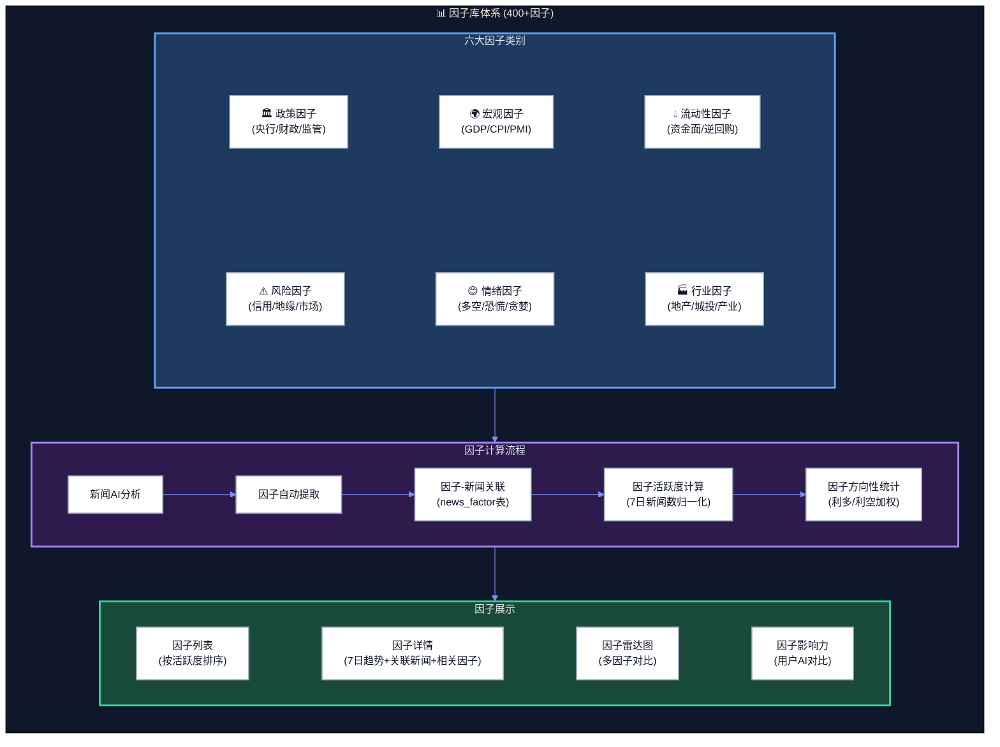
```mermaid
---
config:
  theme: base
  themeVariables:
    background: '#0f172a'
    primaryColor: '#1e293b'
    primaryTextColor: '#e2e8f0'
    primaryBorderColor: '#38bdf8'
    lineColor: '#818cf8'
    secondaryColor: '#312e81'
    tertiaryColor: '#0f172a'
    fontFamily: ''
    fontSize: 14px
---
flowchart TB
    subgraph 因子体系["📊 因子库体系 (400+因子)"]
        direction TB

        subgraph 分类["六大因子类别"]
            direction TB
            subgraph row1[" "]
                direction LR
                C1["🏛️ 政策因子<br/>(央行/财政/监管)"]
                C2["🌍 宏观因子<br/>(GDP/CPI/PMI)"]
                C3["💧 流动性因子<br/>(资金面/逆回购)"]
                C1 ~~~ C2 ~~~ C3
            end
            subgraph row2[" "]
                direction LR
                C4["⚠️ 风险因子<br/>(信用/地缘/市场)"]
                C5["😊 情绪因子<br/>(多空/恐慌/贪婪)"]
                C6["🏭 行业因子<br/>(地产/城投/产业)"]
                C4 ~~~ C5 ~~~ C6
            end
            row1 ~~~ row2
        end

        subgraph 计算["因子计算流程"]
            direction LR
            F1["新闻AI分析"] --> F2["因子自动提取"] --> F3["因子-新闻关联<br/>(news_factor表)"] --> F4["因子活跃度计算<br/>(7日新闻数归一化)"] --> F5["因子方向性统计<br/>(利多/利空加权)"]
        end

        subgraph 展示["因子展示"]
            direction LR
            V1["因子列表<br/>(按活跃度排序)"]
            V2["因子详情<br/>(7日趋势+关联新闻+相关因子)"]
            V3["因子雷达图<br/>(多因子对比)"]
            V4["因子影响力<br/>(用户AI对比)"]
            V1 ~~~ V2 ~~~ V3 ~~~ V4
        end

        %% 模块间流向
        分类 --> 计算 --> 展示
    end

    %% 样式定义
    classDef node fill:#ffffff,stroke:#94a3b8,stroke-width:1.5px,color:#0f172a,font-weight:500
    classDef hidden fill:none,stroke:none
    classDef category fill:#1e3a5f,stroke:#60a5fa,stroke-width:2.5px,color:#e2e8f0
    classDef compute fill:#2d1b4e,stroke:#a78bfa,stroke-width:2.5px,color:#e2e8f0
    classDef display fill:#1a4a3a,stroke:#34d399,stroke-width:2.5px,color:#e2e8f0

    class C1,C2,C3,C4,C5,C6,F1,F2,F3,F4,F5,V1,V2,V3,V4 node
    class 分类 category
    class 计算 compute
    class 展示 display
    class row1,row2 hidden
    class 因子体系 fill:#0f172a,stroke:#38bdf8,stroke-width:3px,color:#e2e8f0
```

## 3.4 收益率曲线分析结构

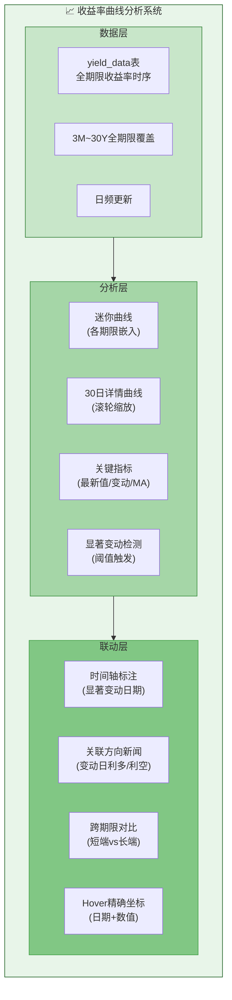
```mermaid
flowchart TB
    subgraph 收益率["📈 收益率曲线分析系统"]
        direction TB
        
        subgraph 数据["数据层"]
            Y1["yield_data表\n全期限收益率时序"]
            Y2["3M~30Y全期限覆盖"]
            Y3["日频更新"]
        end
        
        subgraph 分析["分析层"]
            direction LR
            A1["迷你曲线\n(各期限嵌入)"]
            A2["30日详情曲线\n(滚轮缩放)"]
            A3["关键指标\n(最新值/变动/MA)"]
            A4["显著变动检测\n(阈值触发)"]
        end
        
        subgraph 联动["联动层"]
            direction LR
            L1["时间轴标注\n(显著变动日期)"]
            L2["关联方向新闻\n(变动日利多/利空)"]
            L3["跨期限对比\n(短端vs长端)"]
            L4["Hover精确坐标\n(日期+数值)"]
        end
    end
    
    数据 --> 分析 --> 联动
    
    style 收益率 fill:#e8f5e9,stroke:#1b5e20
    style 数据 fill:#c8e6c9,stroke:#2e7d32
    style 分析 fill:#a5d6a7,stroke:#388e3c
    style 联动 fill:#81c784,stroke:#43a047
```

## 3.5 宏观预测与收益日历

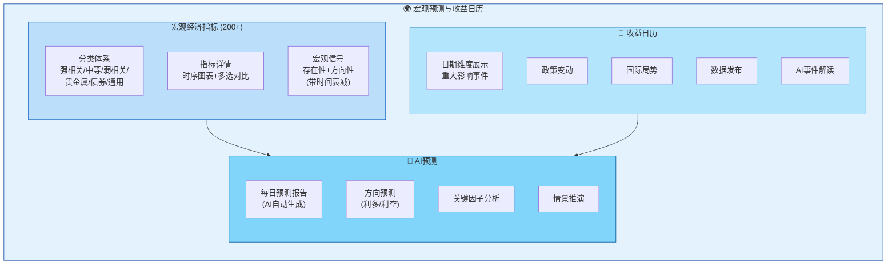
```mermaid
flowchart LR
    subgraph 宏观["🌍 宏观预测与收益日历"]
        direction TB
        
        subgraph 宏观数据["宏观经济指标 (200+)"]
            direction TB
            MD1["分类体系\n强相关/中等/弱相关/\n贵金属/债券/通用"]
            MD2["指标详情\n时序图表+多选对比"]
            MD3["宏观信号\n存在性+方向性\n(带时间衰减)"]
        end
        
        subgraph 收益日历["📅 收益日历"]
            direction TB
            YC1["日期维度展示\n重大影响事件"]
            YC2["政策变动"]
            YC3["国际局势"]
            YC4["数据发布"]
            YC5["AI事件解读"]
        end
        
        subgraph 预测["🔮 AI预测"]
            direction TB
            FC1["每日预测报告\n(AI自动生成)"]
            FC2["方向预测\n(利多/利空)"]
            FC3["关键因子分析"]
            FC4["情景推演"]
        end
    end
    
    宏观数据 --> 预测
    收益日历 --> 预测
    
    style 宏观 fill:#e3f2fd,stroke:#0d47a1
    style 宏观数据 fill:#bbdefb,stroke:#1565c0
    style 收益日历 fill:#b3e5fc,stroke:#0277bd
    style 预测 fill:#81d4fa,stroke:#01579b
```

---

# 第四部分：实战演练 — 从洞察到投资组合优化

## 4.1 关注列表与情景模拟

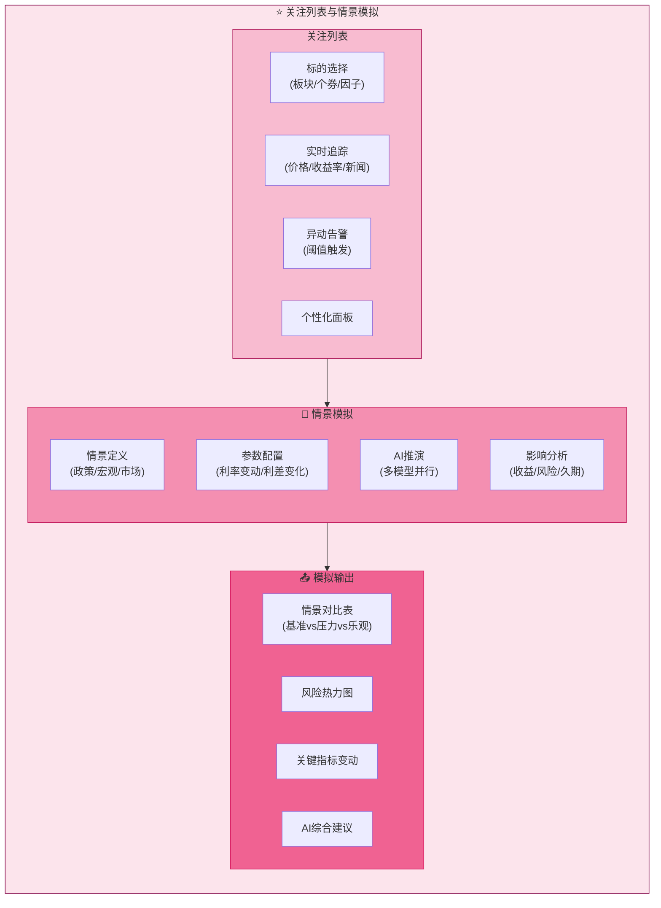
```mermaid
flowchart TB
    subgraph 关注["⭐ 关注列表与情景模拟"]
        direction TB
        
        subgraph 关注列表["关注列表"]
            W1["标的选择\n(板块/个券/因子)"]
            W2["实时追踪\n(价格/收益率/新闻)"]
            W3["异动告警\n(阈值触发)"]
            W4["个性化面板"]
        end
        
        subgraph 情景模拟["🔮 情景模拟"]
            direction TB
            S1["情景定义\n(政策/宏观/市场)"]
            S2["参数配置\n(利率变动/利差变化)"]
            S3["AI推演\n(多模型并行)"]
            S4["影响分析\n(收益/风险/久期)"]
        end
        
        subgraph 输出["📤 模拟输出"]
            O1["情景对比表\n(基准vs压力vs乐观)"]
            O2["风险热力图"]
            O3["关键指标变动"]
            O4["AI综合建议"]
        end
    end
    
    关注列表 --> 情景模拟 --> 输出
    
    style 关注 fill:#fce4ec,stroke:#880e4f
    style 关注列表 fill:#f8bbd0,stroke:#ad1457
    style 情景模拟 fill:#f48fb1,stroke:#c2185b
    style 输出 fill:#f06292,stroke:#d81b60
```

## 4.2 策略生成与回测验证流程

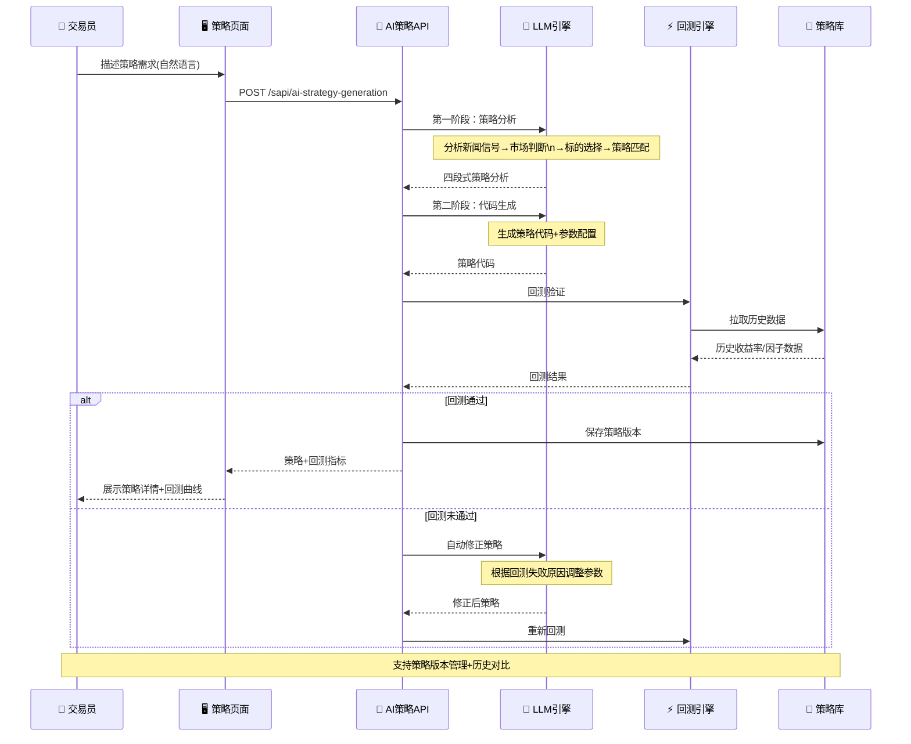
```mermaid
sequenceDiagram
    participant User as 👤 交易员
    participant FE as 🖥️ 策略页面
    participant API as 🔀 AI策略API
    participant LLM as 🧠 LLM引擎
    participant Backtest as ⚡ 回测引擎
    participant DB as 💾 策略库
    
    User->>FE: 描述策略需求(自然语言)
    FE->>API: POST /sapi/ai-strategy-generation
    
    API->>LLM: 第一阶段：策略分析
    Note over LLM: 分析新闻信号→市场判断\n→标的选择→策略匹配
    LLM-->>API: 四段式策略分析
    
    API->>LLM: 第二阶段：代码生成
    Note over LLM: 生成策略代码+参数配置
    LLM-->>API: 策略代码
    
    API->>Backtest: 回测验证
    Backtest->>DB: 拉取历史数据
    DB-->>Backtest: 历史收益率/因子数据
    Backtest-->>API: 回测结果
    
    alt 回测通过
        API->>DB: 保存策略版本
        API-->>FE: 策略+回测指标
        FE-->>User: 展示策略详情+回测曲线
    else 回测未通过
        API->>LLM: 自动修正策略
        Note over LLM: 根据回测失败原因调整参数
        LLM-->>API: 修正后策略
        API->>Backtest: 重新回测
    end
    
    Note over User,DB: 支持策略版本管理+历史对比
```

## 4.3 AI策略推荐引擎

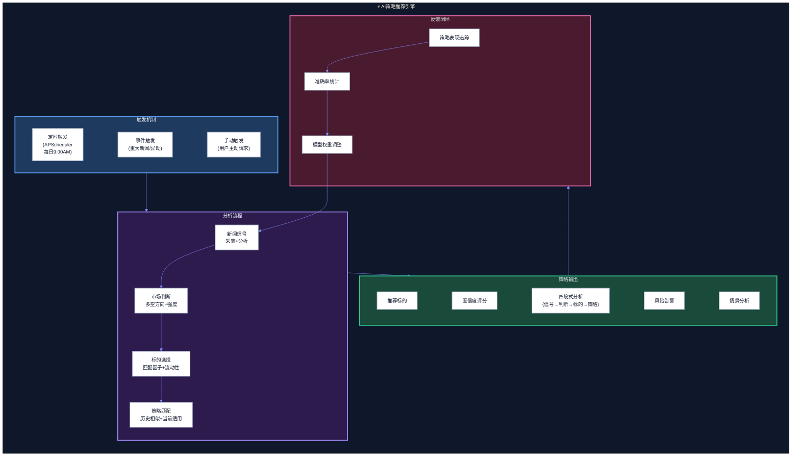
```mermaid
---
config:
  theme: base
  themeVariables:
    background: '#0f172a'
    primaryColor: '#1e293b'
    primaryTextColor: '#e2e8f0'
    primaryBorderColor: '#38bdf8'
    lineColor: '#818cf8'
    secondaryColor: '#312e81'
    tertiaryColor: '#0f172a'
    fontFamily: ''
    fontSize: 14px
---
flowchart TB
    subgraph 策略推荐["⚡ AI策略推荐引擎"]
        direction TB

        subgraph 触发["触发机制"]
            direction LR
            T1["定时触发<br/>(APScheduler<br/>每日9:00AM)"]
            T2["事件触发<br/>(重大新闻/异动)"]
            T3["手动触发<br/>(用户主动请求)"]
            T1 ~~~ T2 ~~~ T3
        end

        subgraph 分析["分析流程"]
            direction LR
            A1["新闻信号<br/>采集+分析"] --> A2["市场判断<br/>多空方向+强度"] --> A3["标的选择<br/>匹配因子+流动性"] --> A4["策略匹配<br/>历史相似+当前适用"]
        end

        subgraph 输出["策略输出"]
            direction LR
            O1["推荐标的"]
            O2["置信度评分"]
            O3["四段式分析<br/>(信号→判断→标的→策略)"]
            O4["风险告警"]
            O5["情景分析"]
            O1 ~~~ O2 ~~~ O3 ~~~ O4 ~~~ O5
        end

        subgraph 反馈["反馈闭环"]
            direction LR
            FB1["策略表现追踪"] --> FB2["准确率统计"] --> FB3["模型权重调整"]
        end

        %% 主流程箭头
        触发 --> 分析 --> 输出 --> 反馈

        %% 反馈闭环（指向分析流程的起点）
        FB3 --> A1
    end

    %% 样式定义
    classDef node fill:#ffffff,stroke:#94a3b8,stroke-width:1.5px,color:#0f172a,font-weight:500
    classDef hidden fill:none,stroke:none
    classDef trigger fill:#1e3a5f,stroke:#60a5fa,stroke-width:2.5px,color:#e2e8f0
    classDef analyze fill:#2d1b4e,stroke:#a78bfa,stroke-width:2.5px,color:#e2e8f0
    classDef output fill:#1a4a3a,stroke:#34d399,stroke-width:2.5px,color:#e2e8f0
    classDef feedback fill:#4a1a2e,stroke:#f472b6,stroke-width:2.5px,color:#e2e8f0

    class T1,T2,T3,A1,A2,A3,A4,O1,O2,O3,O4,O5,FB1,FB2,FB3 node
    class 触发 trigger
    class 分析 analyze
    class 输出 output
    class 反馈 feedback
    class 策略推荐 fill:#0f172a,stroke:#38bdf8,stroke-width:3px,color:#e2e8f0
```

## 4.4 投资组合优化建议

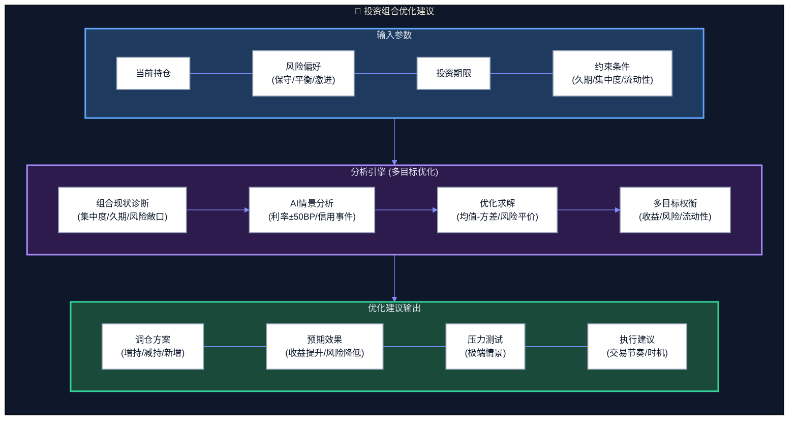
```mermaid
---
config:
  theme: base
  themeVariables:
    background: '#0f172a'
    primaryColor: '#1e293b'
    primaryTextColor: '#e2e8f0'
    primaryBorderColor: '#38bdf8'
    lineColor: '#818cf8'
    secondaryColor: '#312e81'
    tertiaryColor: '#0f172a'
    fontFamily: ''
    fontSize: 14px
---
flowchart TB
    subgraph 组合优化["💼 投资组合优化建议"]
        direction TB

        subgraph 输入层["输入参数"]
            direction LR
            I1["当前持仓"]
            I2["风险偏好<br/>(保守/平衡/激进)"]
            I3["投资期限"]
            I4["约束条件<br/>(久期/集中度/流动性)"]
            I1 --- I2 --- I3 --- I4
        end

        subgraph 分析引擎["分析引擎 (多目标优化)"]
            direction LR
            E1["组合现状诊断<br/>(集中度/久期/风险敞口)"]
            E2["AI情景分析<br/>(利率±50BP/信用事件)"]
            E3["优化求解<br/>(均值-方差/风险平价)"]
            E4["多目标权衡<br/>(收益/风险/流动性)"]
            E1 --> E2 --> E3 --> E4
        end

        subgraph 输出层["优化建议输出"]
            direction LR
            O1["调仓方案<br/>(增持/减持/新增)"]
            O2["预期效果<br/>(收益提升/风险降低)"]
            O3["压力测试<br/>(极端情景)"]
            O4["执行建议<br/>(交易节奏/时机)"]
            O1 --- O2 --- O3 --- O4
        end

        输入层 --> 分析引擎 --> 输出层
    end

    %% 样式定义
    classDef node fill:#ffffff,stroke:#94a3b8,stroke-width:1.5px,color:#0f172a,font-weight:500
    classDef input fill:#1e3a5f,stroke:#60a5fa,stroke-width:2.5px,color:#e2e8f0
    classDef engine fill:#2d1b4e,stroke:#a78bfa,stroke-width:2.5px,color:#e2e8f0
    classDef output fill:#1a4a3a,stroke:#34d399,stroke-width:2.5px,color:#e2e8f0

    class I1,I2,I3,I4,E1,E2,E3,E4,O1,O2,O3,O4 node
    class 输入层 input
    class 分析引擎 engine
    class 输出层 output
    class 组合优化 fill:#0f172a,stroke:#38bdf8,stroke-width:3px,color:#e2e8f0
```

## 4.5 端到端用户旅程

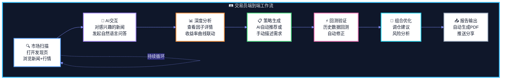
```mermaid
---
config:
  theme: base
  themeVariables:
    background: '#0f172a'
    primaryColor: '#1e293b'
    primaryTextColor: '#e2e8f0'
    primaryBorderColor: '#38bdf8'
    lineColor: '#818cf8'
    secondaryColor: '#312e81'
    tertiaryColor: '#0f172a'
    fontFamily: ''
    fontSize: 14px
---
flowchart LR
    subgraph 旅程["🛤️ 交易员端到端工作流"]
        direction LR

        A["🔍 市场扫描<br>打开发现页<br>浏览新闻+行情"] --> B["🧠 AI交互<br>对感兴趣的新闻<br>发起自然语言问答"]
        B --> C["📊 深度分析<br>查看因子详情<br>收益率曲线联动"]
        C --> D["📋 策略生成<br>AI自动推荐或<br>手动描述需求"]
        D --> E["⚡ 回测验证<br>历史数据回测<br>自动修正"]
        E --> F["💼 组合优化<br>调仓建议<br>风险分析"]
        F --> G["📤 报告输出<br>自动生成PDF<br>推送分享"]

        A -.->|"持续循环"| A
    end

    %% 样式定义：白底黑字 + 彩色霓虹边框
    classDef default fill:#ffffff,stroke:#94a3b8,stroke-width:1.5px,color:#0f172a,font-weight:500

    class A,B,C,D,E,F,G default

    style 旅程 fill:#0f172a,stroke:#38bdf8,stroke-width:3px,color:#e2e8f0
    style A fill:#ffffff,stroke:#60a5fa,stroke-width:2.5px,color:#0f172a
    style B fill:#ffffff,stroke:#a78bfa,stroke-width:2.5px,color:#0f172a
    style C fill:#ffffff,stroke:#fb923c,stroke-width:2.5px,color:#0f172a
    style D fill:#ffffff,stroke:#4ade80,stroke-width:2.5px,color:#0f172a
    style E fill:#ffffff,stroke:#f472b6,stroke-width:2.5px,color:#0f172a
    style F fill:#ffffff,stroke:#22d3ee,stroke-width:2.5px,color:#0f172a
    style G fill:#ffffff,stroke:#94a3b8,stroke-width:2.5px,color:#0f172a
```

---

# 第五部分：技术架构深度

## 5.1 前后端交互架构

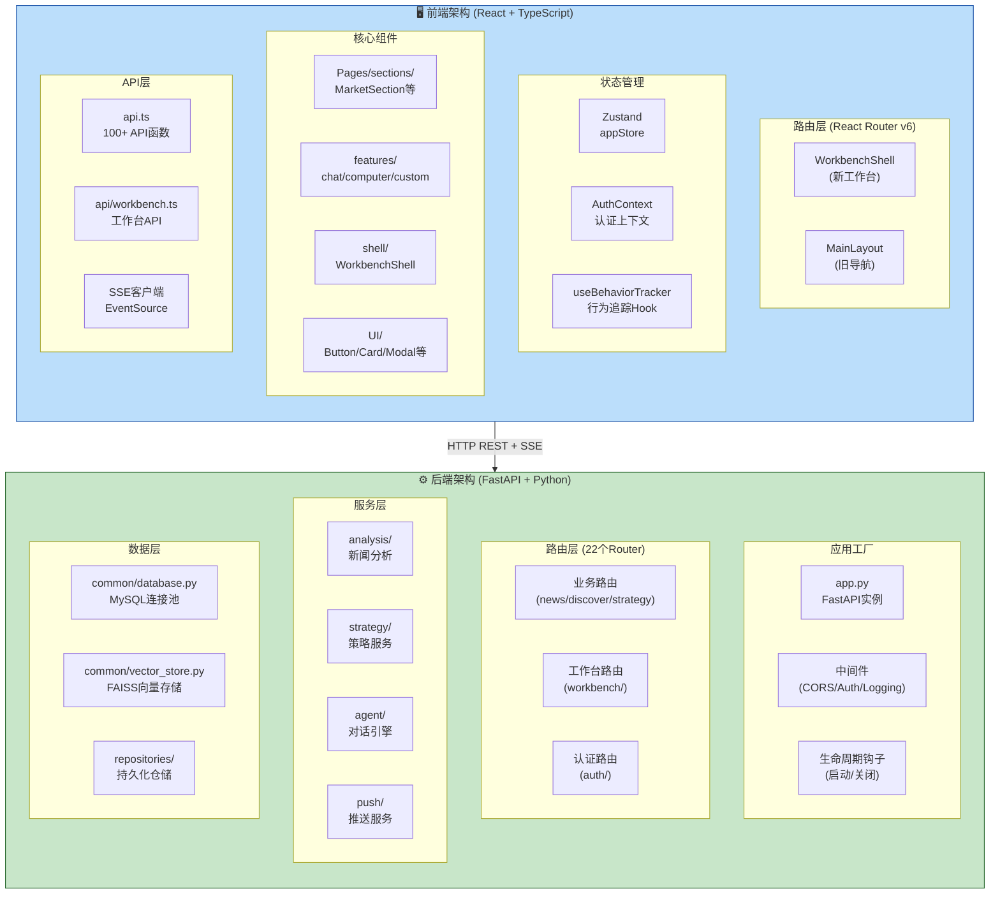
```mermaid
flowchart TB
    subgraph 前端架构["🖥️ 前端架构 (React + TypeScript)"]
        direction TB
        
        subgraph 路由["路由层 (React Router v6)"]
            direction LR
            R1["WorkbenchShell\n(新工作台)"]
            R2["MainLayout\n(旧导航)"]
        end
        
        subgraph 状态["状态管理"]
            S1["Zustand\nappStore"]
            S2["AuthContext\n认证上下文"]
            S3["useBehaviorTracker\n行为追踪Hook"]
        end
        
        subgraph 组件["核心组件"]
            direction LR
            C1["Pages/sections/\nMarketSection等"]
            C2["features/\nchat/computer/custom"]
            C3["shell/\nWorkbenchShell"]
            C4["UI/\nButton/Card/Modal等"]
        end
        
        subgraph API["API层"]
            A1["api.ts\n100+ API函数"]
            A2["api/workbench.ts\n工作台API"]
            A3["SSE客户端\nEventSource"]
        end
    end
    
    subgraph 后端架构["⚙️ 后端架构 (FastAPI + Python)"]
        direction TB
        
        subgraph 应用["应用工厂"]
            AP1["app.py\nFastAPI实例"]
            AP2["中间件\n(CORS/Auth/Logging)"]
            AP3["生命周期钩子\n(启动/关闭)"]
        end
        
        subgraph 路由层["路由层 (22个Router)"]
            direction LR
            RT1["业务路由\n(news/discover/strategy)"]
            RT2["工作台路由\n(workbench/)"]
            RT3["认证路由\n(auth/)"]
        end
        
        subgraph 服务层["服务层"]
            direction LR
            SV1["analysis/\n新闻分析"]
            SV2["strategy/\n策略服务"]
            SV3["agent/\n对话引擎"]
            SV4["push/\n推送服务"]
        end
        
        subgraph 数据层["数据层"]
            DL1["common/database.py\nMySQL连接池"]
            DL2["common/vector_store.py\nFAISS向量存储"]
            DL3["repositories/\n持久化仓储"]
        end
    end
    
    前端架构 -->|"HTTP REST + SSE"| 后端架构
    
    style 前端架构 fill:#bbdefb,stroke:#0d47a1
    style 后端架构 fill:#c8e6c9,stroke:#1b5e20
```

## 5.2 数据库核心ER图

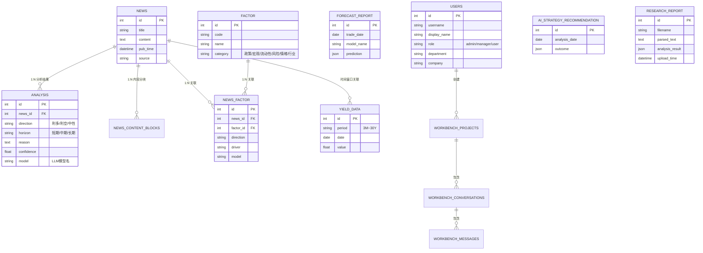
```mermaid
erDiagram
    NEWS ||--o{ ANALYSIS : "1:N 分析结果"
    NEWS ||--o{ NEWS_CONTENT_BLOCKS : "1:N 内容分块"
    NEWS ||--o{ NEWS_FACTOR : "1:N 关联"
    FACTOR ||--o{ NEWS_FACTOR : "1:N 关联"
    NEWS ||--o{ YIELD_DATA : "时间窗口关联"
    
    NEWS {
        int id PK
        string title
        text content
        datetime pub_time
        string source
    }
    
    ANALYSIS {
        int id PK
        int news_id FK
        string direction "利多/利空/中性"
        string horizon "短期/中期/长期"
        text reason
        float confidence
        string model "LLM模型名"
    }
    
    FACTOR {
        int id PK
        string code
        string name
        string category "政策/宏观/流动性/风险/情绪/行业"
    }
    
    NEWS_FACTOR {
        int id PK
        int news_id FK
        int factor_id FK
        string direction
        string driver
        string model
    }
    
    YIELD_DATA {
        int id PK
        string period "3M~30Y"
        date date
        float value
    }
    
    FORECAST_REPORT {
        int id PK
        date trade_date
        string model_name
        json prediction
    }
    
    USERS ||--o{ WORKBENCH_PROJECTS : "创建"
    WORKBENCH_PROJECTS ||--o{ WORKBENCH_CONVERSATIONS : "包含"
    WORKBENCH_CONVERSATIONS ||--o{ WORKBENCH_MESSAGES : "包含"
    
    USERS {
        int id PK
        string username
        string display_name
        string role "admin/manager/user"
        string department
        string company
    }
    
    AI_STRATEGY_RECOMMENDATION {
        int id PK
        date analysis_date
        json outcome
    }
    
    RESEARCH_REPORT {
        int id PK
        string filename
        text parsed_text
        json analysis_result
        datetime upload_time
    }
```

## 5.3 AI分析管道数据流

```mermaid
flowchart LR
    subgraph 采集["📥 数据采集"]
        direction TB
        C1["新闻API采集"]
        C2["研报PDF上传"]
        C3["宏观数据同步"]
        C4["收益率数据更新"]
    end
    
    subgraph 预处理["🔧 预处理"]
        direction TB
        P1["文本清洗+分块"]
        P2["PDF解析\n(pymupdf)"]
        P3["数据标准化"]
        P4["时序对齐"]
    end
    
    subgraph AI分析["🤖 AI分析 (多模型并行)"]
        direction TB
        A1["豆包分析"]
        A2["DeepSeek分析"]
        A3["千问分析"]
        A4["GLM分析"]
    end
    
    subgraph 聚合["📊 结果聚合"]
        direction TB
        G1["方向投票"]
        G2["因子一致提取"]
        G3["置信度加权"]
        G4["矛盾检测+标记"]
    end
    
    subgraph 存储["💾 结果存储"]
        direction TB
        S1[("analysis表\n(分析结果)")]
        S2[("news_factor表\n(因子关联)")]
        S3[("FAISS索引\n(向量嵌入)")]
        S4[("forecast_report表\n(预测报告)")]
    end
    
    subgraph 消费["📤 数据消费"]
        direction TB
        U1["发现页展示"]
        U2["Agent工具查询"]
        U3["策略信号生成"]
        U4["报告自动生成"]
    end
    
    采集 --> 预处理 --> AI分析 --> 聚合 --> 存储 --> 消费
    
    style 采集 fill:#e3f2fd,stroke:#1565c0
    style 预处理 fill:#f3e5f5,stroke:#6a1b9a
    style AI分析 fill:#fff3e0,stroke:#e65100
    style 聚合 fill:#e8f5e9,stroke:#2e7d32
    style 存储 fill:#fce4ec,stroke:#c62828
    style 消费 fill:#ede7f6,stroke:#4527a0
```

## 5.4 SSE实时推送架构

```mermaid
sequenceDiagram
    participant Client as 🖥️ 前端
    participant SSE as 📡 SSE连接
    participant API as FastAPI
    participant Service as ⚙️ 服务层
    participant LLM as 🧠 LLM
    
    Note over Client,LLM: 场景一：Agent对话流式推送
    
    Client->>API: POST /sapi/chat
    API->>SSE: 建立SSE连接
    SSE-->>Client: event: connected
    
    loop Agent推理循环
        API->>Service: Agent处理
        Service->>LLM: 推理请求
        LLM-->>Service: token流
        Service-->>API: 内容片段
        API-->>SSE: event: message
        SSE-->>Client: 实时渲染token
    end
    
    API-->>SSE: event: done
    SSE-->>Client: 对话完成
```

## 5.5 部署架构图

```mermaid
flowchart TB
    subgraph 部署["🚀 Docker Compose 部署架构"]
        direction TB
        
        subgraph 容器["容器服务"]
            direction LR
            
            subgraph FE["frontend容器"]
                F1["Vite Dev Server\n:5173"]
                F2["React SPA"]
            end
            
            subgraph BE["backend容器"]
                B1["Uvicorn\n:8000"]
                B2["FastAPI应用"]
                B3["APScheduler\n定时任务"]
            end
            
            subgraph DB["外部服务"]
                D1[("MySQL\n10.253.50.134:3306\nSentiment_analysis")]
                D2[("FAISS索引\n本地文件系统\ndata/faiss.index")]
            end
        end
        
        subgraph 网络["网络层"]
            N1["CORS全开放\n(开发模式)"]
            N2["JWT认证\n(生产模式)"]
            N3["Nginx反向代理\n(生产模式可选)"]
        end
        
        subgraph 存储["持久化存储"]
            direction LR
            V1["Docker Volume\n模型文件"]
            V2["Docker Volume\n日志文件"]
            V3["Docker Volume\nFAISS索引"]
            V4["Docker Volume\n上传文件"]
        end
    end
    
    FE -->|"HTTP /sapi/*"| BE
    BE --> DB
    网络 --> 容器
    存储 --> 容器
    
    style 部署 fill:#eceff1,stroke:#263238
    style 容器 fill:#cfd8dc,stroke:#37474f
    style 网络 fill:#ffe0b2,stroke:#e65100
    style 存储 fill:#c8e6c9,stroke:#2e7d32
```

## 5.6 项目协作空间架构

```mermaid
flowchart TB
    subgraph 项目协作["👥 项目协作空间"]
        direction TB
        
        subgraph 项目["项目管理"]
            P1["创建项目"]
            P2["加入项目"]
            P3["角色权限\n(创建者/成员/只读)"]
            P4["项目设置"]
        end
        
        subgraph 对话["共享对话"]
            C1["项目内对话\n(所有成员可见)"]
            C2["对话分类\n(按主题/标签)"]
            C3["对话历史\n(自动保存+搜索)"]
            C4["Agent共享\n(成员均可调用)"]
        end
        
        subgraph 记忆["记忆管理"]
            M1["项目上下文\n(共享知识库)"]
            M2["分析历史\n(策略+因子偏好)"]
            M3["决策记录\n(谁做了什么决策)"]
            M4["知识沉淀\n(AI总结+标签)"]
        end
        
        subgraph 协作["协作功能"]
            CL1["实时同步\n(对话+数据)"]
            CL2["消息通知\n(策略更新/异动)"]
            CL3["共享视图\n(看板+图表)"]
            CL4["权限控制\n(数据隔离)"]
        end
    end
    
    项目 --> 对话 --> 记忆 --> 协作
    
    style 项目协作 fill:#e8eaf6,stroke:#1a237e
    style 项目 fill:#c5cae9,stroke:#283593
    style 对话 fill:#9fa8da,stroke:#3949ab
    style 记忆 fill:#7986cb,stroke:#5c6bc0
    style 协作 fill:#5c6bc0,stroke:#303f9f
```

## 5.7 用户行为追踪与分析

```mermaid
flowchart LR
    subgraph 埋点["📊 用户行为追踪体系"]
        direction TB
        
        subgraph 前端采集["前端采集 (useBehaviorTracker)"]
            F1["页面路由\n(page_route)"]
            F2["操作类型\n(action_type)"]
            F3["停留时长\n(duration_sec)"]
            F4["会话ID\n(session_id)"]
        end
        
        subgraph 批量上报["批量上报"]
            B1["POST /sapi/dashboard/\nbehavior/batch"]
            B2["定时批量发送\n(减少请求)"]
        end
        
        subgraph 后端存储["后端存储"]
            S1[("user_behavior_events\n行为事件表")]
            S2[("user_behavior_profiles\n用户画像表")]
        end
        
        subgraph 分析输出["分析输出"]
            A1["用户活跃度"]
            A2["功能偏好\n(page_affinity)"]
            A3["高峰时段\n(peak_hour)"]
            A4["流失风险\n(churn_risk_score)"]
            A5["部门对比"]
        end
    end
    
    前端采集 --> 批量上报 --> 后端存储 --> 分析输出
    
    style 埋点 fill:#e0f2f1,stroke:#004d40
    style 前端采集 fill:#b2dfdb,stroke:#00695c
    style 批量上报 fill:#80cbc4,stroke:#00796b
    style 后端存储 fill:#4db6ac,stroke:#00897b
    style 分析输出 fill:#26a69a,stroke:#00695c
```

## 5.8 策略变更对比系统

```mermaid
flowchart TB
    subgraph 变更系统["🔄 策略变更对比系统"]
        direction TB
        
        subgraph 快照["快照管理"]
            SN1["定时快照\n(每日自动)"]
            SN2["手动快照\n(用户触发)"]
            SN3["事件快照\n(重大变动触发)"]
        end
        
        subgraph 对比["对比分析"]
            CP1["版本差异\n(前后对比)"]
            CP2["AI变更检测\n(自动识别变动)"]
            CP3["变更归因\n(什么因子导致)"]
        end
        
        subgraph 展示["可视化展示"]
            V1["Diff视图\n(新旧对比)"]
            V2["变更时间线\n(历史演变)"]
            V3["影响分析\n(变更效果评估)"]
        end
    end
    
    快照 --> 对比 --> 展示
    
    style 变更系统 fill:#f3e5f5,stroke:#4a148c
    style 快照 fill:#e1bee7,stroke:#6a1b9a
    style 对比 fill:#ce93d8,stroke:#7b1fa2
    style 展示 fill:#ba68c8,stroke:#8e24aa
```

---

## 附录：PPT使用建议

### 图表与汇报框架对应关系

| PPT章节 | 推荐图表 | 图表编号 |
|---------|---------|---------|
| **一、痛点与愿景** | 传统交易效率瓶颈 | 1.1 |
| | 多源数据整合难度 | 1.2 |
| | 平台核心愿景 | 1.3 |
| | 产品全景图 | 1.4 |
| **二、核心引擎** | 平台整体技术架构 | 2.1 |
| | 自然语言即时问答流程 | 2.2 |
| | Agent工具编排架构 | 2.3 |
| | Computer技能中心 | 2.4 |
| | 多模型AI分析管道 | 2.5 |
| **三、信息展示与分析** | 实时市场情报中心 | 3.1 |
| | 发现页数据联动 | 3.2 |
| | 因子库体系架构 | 3.3 |
| | 收益率曲线分析 | 3.4 |
| | 宏观预测与收益日历 | 3.5 |
| **四、实战演练** | 关注列表与情景模拟 | 4.1 |
| | 策略生成与回测验证 | 4.2 |
| | AI策略推荐引擎 | 4.3 |
| | 投资组合优化建议 | 4.4 |
| | 端到端用户旅程 | 4.5 |
| **技术附录** | 前后端交互架构 | 5.1 |
| | 数据库核心ER图 | 5.2 |
| | AI分析管道数据流 | 5.3 |
| | SSE实时推送架构 | 5.4 |
| | 部署架构图 | 5.5 |
| | 项目协作空间 | 5.6 |
| | 用户行为追踪 | 5.7 |
| | 策略变更对比 | 5.8 |

### 渲染工具推荐
- **VS Code**: 安装 `Mermaid Preview` 插件，实时预览
- **Typora**: 原生支持Mermaid渲染
- **PPT**: 使用 [Mermaid Live Editor](https://mermaid.live) 在线编辑，导出为PNG/SVG后插入PPT
- **导出命令**: `mmdc -i diagram.mmd -o diagram.png -t neutral --scale 3`
